# Deep-Learning-Project
# ABSTRACT
Numerous endeavors have been made in the correct detection and segmentation of objects such that Deep Learning has reached a point of extracting excellent features of objects from an image and use those features for a plethora of tasks related to computer vision. Our work is divided into two parts. The first part is to detect individual fruits and obtain a pixel-wise mask for each detected fruit in an image. To this end, we have used a deep learning approach, named Mask-RCNN, which is a state-of-the-art instance segmentation framework, for the detection and pixel-wise segmentation of fruits on multi-class RGB images. The dataset being used for this task is “Fruit Recognition Dataset” containing multi-class images. The second part of this work is the classification of real vs fake fruits. For this, we have used “Hyperspectral & Color Imaging” dataset which contains hyperspectral images of 5 different fruit classes.

## Dataset Sources
The two datasets that were used during the course of this project are:

1. [Fruit Recognition Dataset](https://zenodo.org/record/1310165)

2. [Hyperspectral & Color Imaging](https://sites.google.com/site/hyperspectralcolorimaging/dataset)

# **Fruits detection using Mask-RCNN**

## Dataset:
 [Fruit Recognition Dataset](https://zenodo.org/record/1310165)
 
Total Classes: 5
Picture Dimensions: 320×258
Total number of images: 500

## Input Images
These are the input images for our model: 

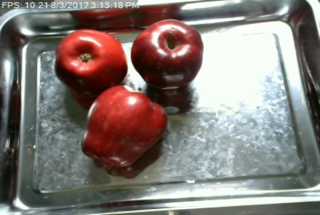
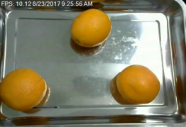
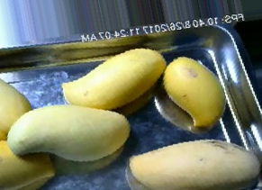
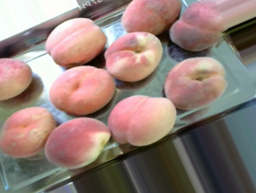
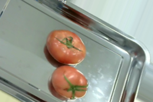

## Mask_RCNN Architecture

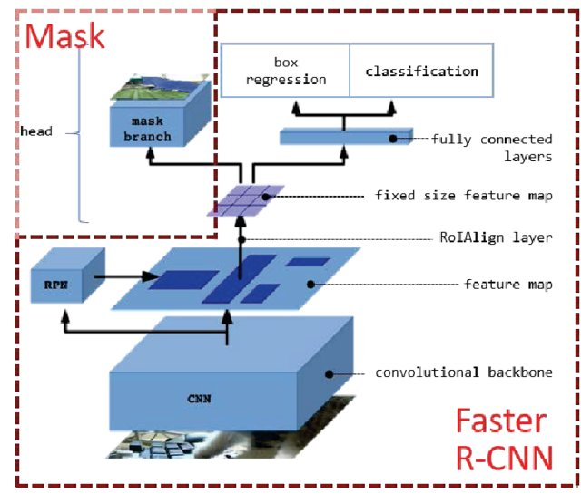

## Results
### Output Images

Outputs of our model are:

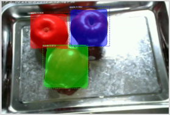
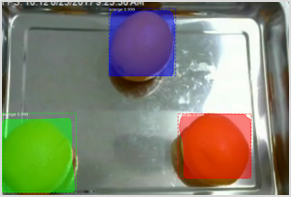
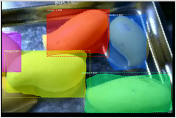
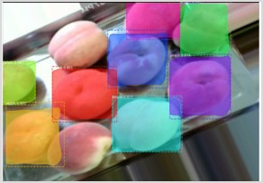
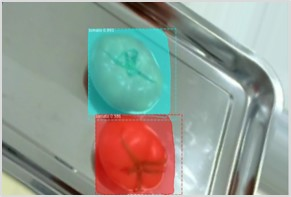

### Mean Accuracy Precision (mAP)
Here is the mean accuracy precision of our model trying with different Input over Union (IoU) thresholds:

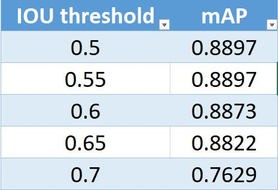

# **Fruits Classification on Hyperspectral Images**

## Dataset:
Total Classes: 4
Total Bands: 396
Picture Dimensions:  1106 x 1312 x 396
Total number of images: 20

## Input Image
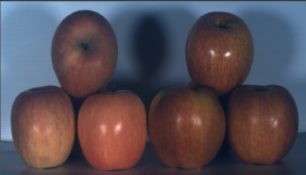

## DenseNet121 Architecture

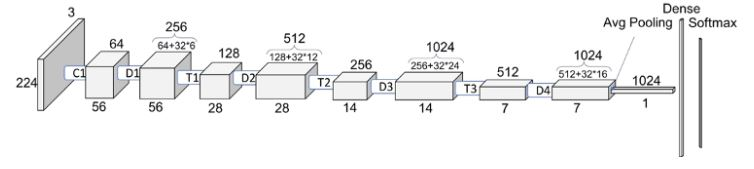

## Results
### Accuracy
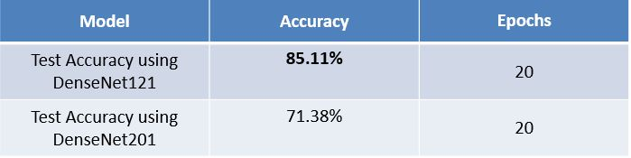

### Confusion Matrices
#### DenseNet121
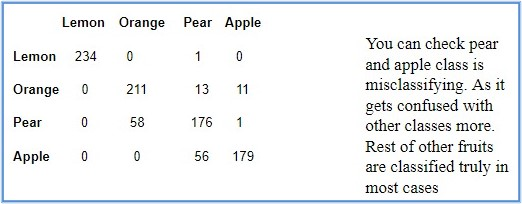

#### DenseNet201
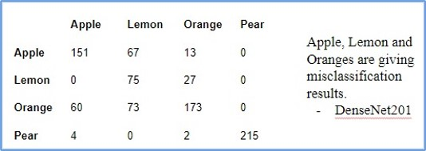

# **Fake vs Real Fruits Classification on Hyperspectral Images**

## Dataset:
Total Classes: 4
Total Bands: 396
Picture Dimensions:  1106 x 1312 x 396
Total number of images: 20

## Input Image

## DenseNet121 Architecture

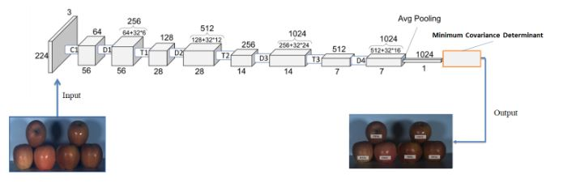

## Output Image
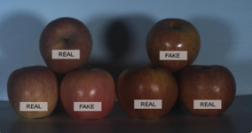

## Results

In this task we performed several experiments 

